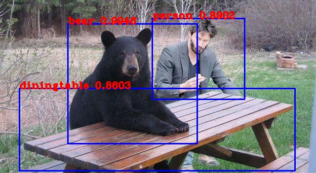

# YOLOv3 with Tensorflow 2.0

You can find the notebook in [Project/YOLOv3-Tensorflow.ipynb](.Project/YOLOv3-Tensorflow.ipynb).

---

#### License
[MIT](./LICENSE)

---

With :heart: by [Anastasia Kim (@gingermuffin)](https://github.com/gingermuffin)
